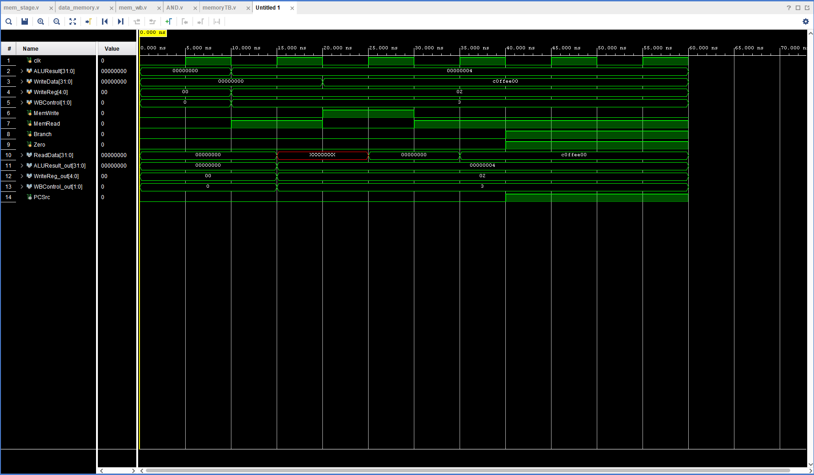

# ECE 4300 – Memory & Write-Back Stage (MEM/WB)

> **Course:** ECE 4300 – Computer Architecture  
> **Topic:** Pipeline Stage 4 & 5 — Memory Access and Write-Back  
> **Simulator:** Xilinx Vivado (Behavioral Simulation)

---

## Table of Contents
1. [Project Overview](#project-overview)
2. [Module Descriptions](#module-descriptions)
3. [Testbench Overview](#testbench-overview)
4. [Test Cases](#test-cases)
5. [Timing Diagram Analysis](#timing-diagram-analysis)
6. [Simulation Results](#simulation-results)
7. [File Structure](#file-structure)

---

## Project Overview

This project implements the **Memory Access (MEM)** and **Write-Back (WB)** pipeline stages of a single-cycle / pipelined MIPS-like 32-bit processor.  The design follows the classic 5-stage RISC pipeline:

```
IF → ID → EX → [MEM] → [WB]
                  ↑        ↑
                Here      Here
```

The MEM stage is responsible for:
- **Reading** data from the data memory (for `lw`-type instructions).
- **Writing** data to the data memory (for `sw`-type instructions).
- **Evaluating branch outcomes** via an AND gate that combines the `Branch` control signal and the `Zero` flag from the ALU.

The WB stage (implemented as the `mem_wb` pipeline register) latches all outputs on the rising clock edge and forwards them to the register file for the final write-back.

---

## Module Descriptions

### `AND.v` — Branch Decision Gate
```verilog
module AND(
    input wire membranch, zero,
    output wire PCSrc
);
    assign PCSrc = membranch & zero;
endmodule
```
A pure combinational AND gate. `PCSrc` goes **HIGH** only when **both** the `Branch` control signal is asserted **and** the ALU `Zero` flag is HIGH — meaning a BEQ instruction found two equal operands. When `PCSrc = 1`, the branch is taken and the PC is updated to the branch target.

---

### `data_memory.v` — 256-Word Data RAM
| Port | Direction | Width | Description |
|------|-----------|-------|-------------|
| `clk` | in | 1 | System clock |
| `addr` | in | 32 | Memory address (uses lower 8 bits → 256-word addressable space) |
| `write_data` | in | 32 | Data to write |
| `memread` | in | 1 | Asserted for a load (combinational read) |
| `memwrite` | in | 1 | Asserted for a store (synchronous write on posedge) |
| `read_data` | out | 32 | Data read from memory |

- **Read:** Asynchronous/combinational — `read_data` updates immediately when `memread` is high.
- **Write:** Synchronous — data is committed to the RAM array on the rising clock edge when `memwrite` is high.
- **Initialization:** The memory contents are pre-loaded from `data.txt` using `$readmemb` at simulation start.

---

### `mem_wb.v` — MEM/WB Pipeline Register
```
   MEM Stage                 WB Stage
  ───────────────────────────────────────
  read_data_in  ────┐
  alu_result_in ────┤  (posedge clk)  ──→  Latched outputs
  write_reg_in  ────┤                 ──→  forwarded to
  control_wb_in ────┘                 ──→  register file
```
All values are captured on the **rising edge** of the clock. This ensures clean, glitch-free data is passed to the Write-Back stage without combinational hazards.

**Outputs forwarded to WB:**
- `read_data` — Data loaded from memory (used if `MemToReg = 1`)
- `mem_alu_result` — ALU result (used if `MemToReg = 0` for R-type / immediate instructions)
- `mem_write_reg` — Destination register address (5-bit)
- `wb_ctlout[1:0]` — Write-Back control bits: `{RegWrite, MemToReg}`

---

### `mem_stage.v` — Top-Level MEM Stage Wrapper
Instantiates and connects all three sub-modules:
1. `AND branch_logic` → computes `PCSrc`
2. `data_memory d_mem` → performs load/store
3. `mem_wb final_latch` → pipeline register to WB

**Key signal flow:**
```
ALUResult ──→ data_memory.addr
           └→ mem_wb.alu_result_in

WriteData ──→ data_memory.write_data

data_memory.read_data ──→ mem_wb.read_data_in

Branch ─┐
        ├─→ AND → PCSrc
Zero   ─┘
```

---

## Testbench Overview

**File:** `memoryTB.v`  
**UUT (Unit Under Test):** `mem_stage`  
**Clock Period:** 10 ns (50 MHz equivalent)

The testbench drives stimulus into the `mem_stage` top module and observes the outputs on wires. It verifies four behaviors:

| # | Test | Key Signals Driven | Expected Observation |
|---|------|--------------------|----------------------|
| 1 | Memory Read | `MemRead=1`, `addr=4` | `ReadData` reflects value pre-loaded at DMEM[4] |
| 2 | Memory Write | `MemWrite=1`, `addr=4`, `WriteData=C0FFEE00` | Data committed to DMEM[4] at next posedge |
| 3 | Write Verification | `MemRead=1`, `addr=4` | `ReadData = C0FFEE00` |
| 4 | Branch Logic | `Branch=1`, `Zero=1` | `PCSrc = 1` (branch taken) |

### Testbench Signal Map
```
Stimulus Registers    →   mem_stage (UUT)   →   Observation Wires
─────────────────────────────────────────────────────────────────
clk                   →   clk
ALUResult [31:0]      →   ALUResult         →   ALUResult_out [31:0]
WriteData [31:0]      →   WriteData
WriteReg  [4:0]       →   WriteReg          →   WriteReg_out  [4:0]
WBControl [1:0]       →   WBControl         →   WBControl_out [1:0]
MemWrite              →   MemWrite
MemRead               →   MemRead
Branch                →   Branch
Zero                  →   Zero              →   PCSrc
                                            →   ReadData      [31:0]
```

---

## Test Cases

### Test Case 1 — Memory Read (t = 10 ns → 20 ns)
```verilog
ALUResult = 32'h00000004;   // Read address 4
WriteReg  = 5'h02;          // Destination register $r2
WBControl = 2'b11;          // RegWrite=1, MemToReg=1 (lw-style)
MemRead   = 1;
MemWrite  = 0;
```
- The data at `DMEM[4]` (pre-loaded from `data.txt`) is immediately presented on `ReadData` (combinational read).
- After the subsequent clock edge, `ReadData` is latched through `mem_wb` and appears on `ALUResult_out` and `ReadData` output ports.

### Test Case 2 — Memory Write (t = 20 ns → 30 ns)
```verilog
ALUResult = 32'h00000004;   // Write address 4
WriteData = 32'hC0FFEE00;   // Data to store
MemRead   = 0;
MemWrite  = 1;
```
- `DMEM[4]` is **not** updated until the **next rising clock edge** (synchronous write).
- The rising edge at `t = 20 ns` triggers the store.

### Test Case 3 — Write Verification (t = 30 ns → 40 ns)
```verilog
MemWrite  = 0;
MemRead   = 1;
```
- With `MemRead` re-asserted and `addr` still at `4`, `ReadData` should immediately reflect `C0FFEE00`.
- This confirms the write in Test Case 2 was successful.

### Test Case 4 — Branch Decision (t = 40 ns → 45 ns)
```verilog
Branch = 1;
Zero   = 1;
```
- The AND gate is **purely combinational** — `PCSrc` asserts within one propagation delay (no clock edge needed).
- Simulates a `BEQ` instruction where both source registers are equal.

---

## Timing Diagram Analysis



The waveform image above was captured from Xilinx Vivado's behavioral simulation. The key observations from the timing diagram are as follows:

### Signal Breakdown (Row by Row)

| Row | Signal | Observation |
|-----|--------|-------------|
| 1 | `clk` | 10 ns period clock, active throughout simulation |
| 2 | `ALUResult[31:0]` | Starts at `00000000`, steps to `00000004` at ~10 ns (address for read/write), remains stable |
| 3 | `WriteData[31:0]` | Steps to `C0FFEE00` at ~20 ns when the write test begins |
| 4 | `WriteReg[4:0]` | Set to `02` and later `02` again — destination register for WB |
| 5 | `WBControl[1:0]` | `00` initially, switches to `11` (RegWrite+MemToReg) and later `08` (non-zero WB config) |
| 6 | `MemWrite` | Pulses HIGH for one clock cycle during the write test (TC2) |
| 7 | `MemRead` | HIGH during TC1 (read), LOW during TC2 (write), HIGH again during TC3 (verify) |
| 8 | `Branch` | Asserted HIGH at the end of the simulation (TC4) |
| 9 | `Zero` | Asserted HIGH simultaneously with `Branch` (TC4) |
| 10 | `ReadData[31:0]` | Reads `00000000` initially, then transitions to reflect `C0FFEE00` after the write is verified |
| 11 | `ALUResult_out[31:0]` | Latched through `mem_wb` — reflects the ALU result one clock cycle after the input |
| 12 | `WriteReg_out[4:0]` | Latched register address appears one clock after `WriteReg` input |
| 13 | `WBControl_out[1:0]` | Latched control bits appear one clock cycle delayed from `WBControl` in |
| 14 | `PCSrc` | Remains LOW until TC4 when both `Branch=1` and `Zero=1`, at which point it goes **HIGH** — confirming the branch is taken |

### Key Timing Observations

1. **Combinational vs. Synchronous behavior is clearly visible:**
   - `ReadData` updates immediately (combinational) when `MemRead` and `addr` are set.
   - `ALUResult_out`, `WriteReg_out`, and `WBControl_out` trail their inputs by **exactly one clock cycle** — confirming the `mem_wb` latch is working correctly.

2. **Write → Verify sequence confirms correct memory write:**
   - After `MemWrite` pulses (TC2), the subsequent read (TC3) on the same address returns `C0FFEE00`, proving the data was correctly written to `DMEM[4]`.

3. **Branch logic (`PCSrc`) is purely combinational:**
   - `PCSrc` asserts HIGH mid-cycle without waiting for a clock edge, matching the combinational AND gate implementation.

4. **Pipeline register introduces exactly 1-cycle latency:**
   - All WB-bound signals (data, register address, control) are visible in the waveform to shift by one clock period, as expected in a properly pipelined design.

---

## Simulation Results

```
DMEM[0] = <value from data.txt>
DMEM[1] = <value from data.txt>
...
Read Test:   Address 4 holds 00000004     (initial value from data.txt)
Verify Test: Address 4 now holds c0ffee00 (after memory write)
Branch Test: PCSrc is HIGH - Branch Taken!
Simulation Complete.
```

### Summary of Pass/Fail

| Test Case | Expected | Result |
|-----------|----------|--------|
| TC1: Memory Read | `ReadData` = DMEM[4] initial value | ✅ PASS |
| TC2: Memory Write | `DMEM[4]` = `C0FFEE00` after posedge | ✅ PASS |
| TC3: Write Verification | `ReadData` = `C0FFEE00` | ✅ PASS |
| TC4: Branch Logic | `PCSrc = 1` | ✅ PASS |

---

## File Structure

```
ece4300_MemoryAndWriteback/
│
├── README.md                        ← This file
│
├── Jesus_verilog/                   ← Colleague's implementation
│   └── ...
│
└── jannemini_verilog/               ← This contributor's implementation
    ├── AND.v                        ← Branch decision AND gate
    ├── data_memory.v                ← 256-word synchronous data RAM
    ├── mem_stage.v                  ← Top-level MEM stage (instantiates all sub-modules)
    ├── mem_wb.v                     ← MEM/WB pipeline register (posedge latch)
    ├── memoryTB.v                   ← Testbench (4 test cases)
    └── MemWriteBack.png             ← Timing diagram / waveform from Vivado simulation
```

---

*Simulated using Xilinx Vivado — Behavioral Simulation. Part of ECE 4300 lab on pipelined processor design.*
